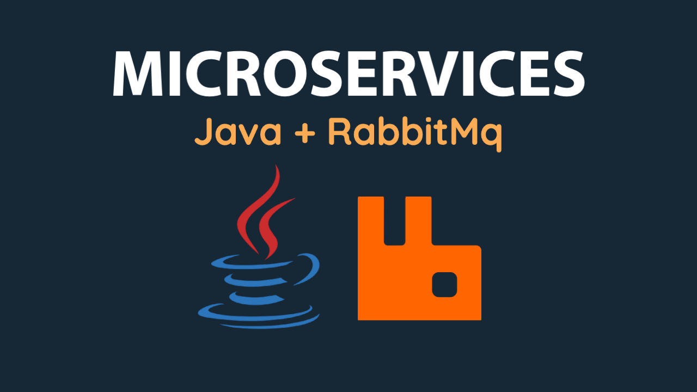
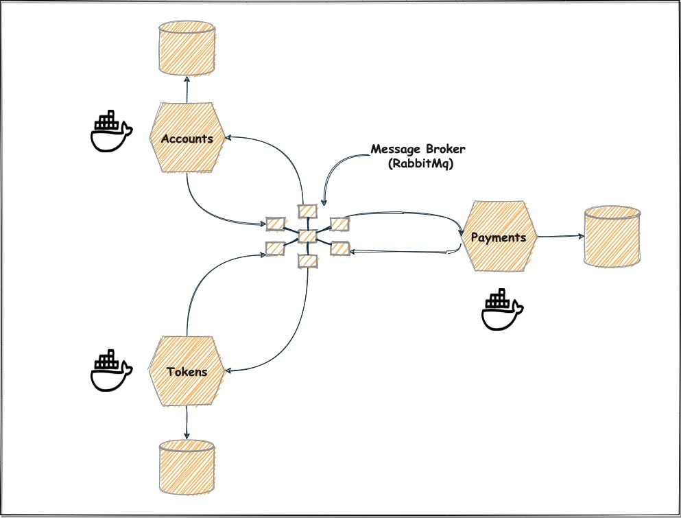
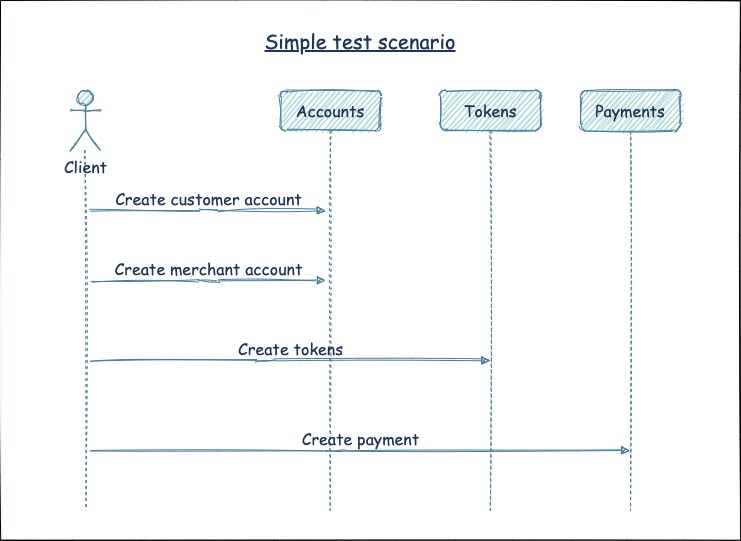

# Microservices with Java

YouTube Link - https://youtu.be/7lM4uh_60Mc

This project shows how to build a microservices solution with Java, Docker and RabbitMq. It has a corresponding video on [YouTube](https://youtu.be/7lM4uh_60Mc) where you can learn:

1. How to outline a microservices architecture.
2. How to create a microservice with Java.
3. How to structure the microservice using SOLID principles.
5. How to create unit and integration tests.
6. How to create end to end tests.
7. How to use docker to containerise the microservice.
8. How to use docker-compose to orchestrate multiple containers.
9. How to use build scripts to automate build tasks.

## Prerequisites:

You need to have the following installed on your machine to follow along with the project:

1. [Java 11](https://openjdk.java.net/projects/jdk/11/)
2. [Maven](https://maven.apache.org/)
3. [Docker](https://www.docker.com/products/docker-desktop)
4. [VS Code](https://code.visualstudio.com/)

## Tech Stack

1. [Java 11](https://openjdk.java.net/projects/jdk/11/)
2. [Quarkus](http://quarkus.io/)
3. [Maven](https://maven.apache.org/)
4. [Docker](https://www.docker.com/products/docker-desktop)
5. [Junit 5](https://junit.org/junit5/)
6. [Mockito](https://site.mockito.org/)
7. [Cucumber](https://cucumber.io/)
8. [Docker-Compose](https://docs.docker.com/compose/)

# Solution

## Architecture Outline

## Payments Service

This is the main microservice in this solution where payments from a customer to a merchant will be registered. To create a payment both the customer and the merchant should already have accounts in the system and a valid token generated by the system should also be sent in the request.

| HTTP Verb | API            | Description          | Request Body         | Response Body |
| --------- | :------------- | :------------------- | :------------------- | :------------ |
| GET       | /payments/{id} | Get a payment by id  | None                 | Payment       |
| POST      | /payments      | Create a new payment | CreatePaymentRequest |               |

## Accounts Service

This service is responsible for managing accounts. Accounts for customers and merchants should be created using this service before trying to register a payment.

| HTTP Verb | API            | Description          | Request Body         | Response Body |
| --------- | :------------- | :------------------- | :------------------- | :------------ |
| GET       | /accounts/{id} | Get an account by id | None                 | Account       |
| POST      | /accounts      | Create a new account | CreateAccountRequest |               |

## Tokens Service

This service is responsible for token management. For now, to keep things simple, it just allow creating some tokens to be used when registering payments without any further business logic.

| HTTP Verb | API     | Description       | Request Body        | Response Body  |
| --------- | :------ | :---------------- | :------------------ | :------------- |
| POST      | /tokens | Create new tokens | CreateTokensRequest | List of Tokens |

## System Tests

Shows how an end-to-end test for a business scenario could be tested using Cucumber and JUnit 5.

YouTube Link - https://youtu.be/7lM4uh_60Mc
